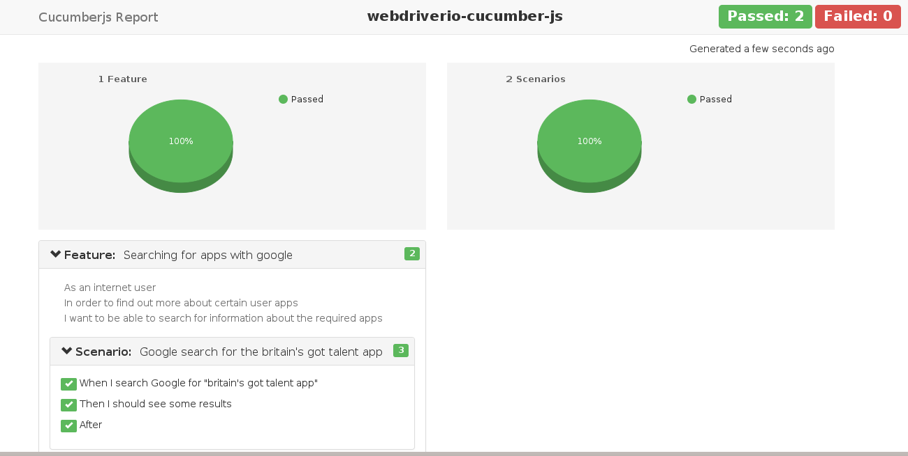

[](https://nodei.co/npm/webdriverio-cucumber-js/)

# webdriverio-cucumber-js 

  A debuggable JS BDD framework using [webdriver.io (the Selenium 2.0 bindings for NodeJS)](http://webdriver.io/),[nodeJs](https://nodejs.org/en/) and [cucumber-js](https://github.com/cucumber/cucumber-js "view cucumber js documentation"), complete with built-in API Testing. 


## Installation

```bash
npm install webdriverio-cucumber-js 
#

# To run your test locally, you'll need a local selenium server running, you can install and launch a selenium standalone server with chrome, firefox and phantomjs drivers via the following commands in a seperate terminal:

npm install selenium-standalone@latest -g --save-dev
selenium-standalone install
selenium-standalone start
```

## Usage

```bash
node ./node_modules/webdriverio-cucumber-js/index.js -s ./step-definitions
or
node index.js -d -t @search
```

### Options

```bash
-h, --help                   output usage information
-v, --version                output the version number
-s, --steps <path>           path to step definitions. defaults to ./step-definitions
-p, --pageObjects <path>     path to page objects. defaults to ./page-objects
-o, --sharedObjects [paths]  path to shared objects - repeatable. defaults to ./shared-objects
-b, --browser <path>         name of browser to use. defaults to chrome
-r, --reports <path>         output path to save reports. defaults to ./reports
-d, --disableTestReport [optional]  disables the test report from opening after test completion
-t, --tags <tagName>         name of tag to run
```

By default tests are run using Google Chrome, to run tests using another browser supply the name of that browser along with the `-b` switch. Available options are:

| Browser | Example |
| :--- | :--- |
| Chrome | `-b chrome` |
| Firefox | `-b firefox` |
| Phantom JS | `-b phantomjs` |

### Feature files

A feature file is a [Business Readable, Domain Specific Language](http://martinfowler.com/bliki/BusinessReadableDSL.html) file that lets you describe software’s behaviour without detailing how that behaviour is implemented. Feature files are written using the [Gherkin syntax](https://github.com/cucumber/cucumber/wiki/Gherkin) and must live in a folder named **features** within the root of your project.

```gherkin
duckDuckGo-search.feature

Feature: Searching for apps with duckduckgo
  As an internet user
  In order to find out more about certain user apps
  I want to be able to search for information about the required apps

  Background:
    Given The user arrives on the duckduckgo search page

  Scenario Outline: User inputs some search data
    When they input <searchword>
    Then they should see some results

    Examples:
      |searchword |
      |britian's got talent |
      |angry birds          |

```

The browser automatically closes after each scenario to ensure the next scenario uses a fresh browser environment.

### Step definitions

Step definitions act as the glue between features files and the actual system under test.

_To avoid confusion **always** return a JavaScript promise your step definition in order to let cucumber know when your task has completed._

```javascript
// ./step-definitions/duckDuckGo-search-steps.js

module.exports = function () {

    this.Then(/^I should see some results$/, function(){

            /** driver waitUntil returns a promise so return that */
            return driver.waitUntil(driver.element('div.g'), 10000).then(function(){

                /** return the promise of an element to the following then. */
                return driver.element('div.g')
            })
            .then(function(elements){

                /** verify this element has children */
                expect(elements.length).to.not.equal(0);
            })
        });
};
```
The following variables are available within the ```Given()```, ```When()``` and ```Then()``` functions:

| Variable | Description |
| :--- | :---  |
| `driver`     | an instance of [web driver](http://webdriver.io/guide/services/selenium-standalone.html) (_the browser_) |
| `webdriverio`| the raw [webdriver](http://webdriver.io/api.html) module, providing access to static properties/methods |
| `page`       | collection of **page** objects loaded from disk and keyed by filename |
| `shared`     | collection of **shared** objects loaded from disk and keyed by filename |
| `helpers`    | a collection of [helper methods](runtime/helpers.js) _things webdriver.io does not provide but really should!_ |
| `expect`     | instance of [chai expect](http://chaijs.com/api/bdd/) to ```expect('something').to.equal('something')``` |
| `assert`     | instance of [chai assert](http://chaijs.com/api/assert/) to ```assert.isOk('everything', 'everything is ok')``` |
| `trace`      | handy trace method to log console output with increased visibility |
| `fs`         | exposes fs (file system) for use globally |
| `dir`        | exposes dir for getting an array of files, subdirectories or both |
| `request`    | exposes the request-promise for API testing | ```use for making API calls``` |
| `date`       | exposes the date method for logs and reports  |
| `log`        | exposes the log method for output to files and emailing  |
| `envConfig`  | exposes the global environment configuration file  | ```for use when changing environment types (i.e. dev, test, preprod)``` |


### Page objects

Page objects are accessible via a global ```page``` object and are automatically loaded from ```./page-objects``` _(or the path specified using the ```-p``` switch)_. Page objects are exposed via a camel-cased version of their filename, for example ```./page-objects/duckDuckGo-search.js``` becomes ```page.duckDuckGoSearch```.

Page objects also have access to the same runtime variables available to step definitions.

An example page object:

```javascript
// ./page-objects/duckDuckGo-search.js

module.exports = {

    /** test searching for inputted data
     */
    url: 'https://duckduckgo.com/',

    /** enters a search term into ebay's search box and presses enter
     * @param {string} searchWord
     * @returns {Promise} a promise to enter the search values
     */
    performSearch: function (searchWord) {

        let elements = {
            searchInput: ('#search_form_input_homepage'),
            searchResultLink: ('div.g > h3 > a')
        };

        let selector = elements.searchInput;

        return driver.setValue(selector, searchWord).then(function(){
            
            return driver.click('#search_button_homepage')
        });
    }
};
```

And its usage within a step definition:

```js
// ./step-definitions/duckDuckGo-search-steps.js

     this.Then(/^The user arrives on the duckduckgo search page$/, function() {
            return helpers.loadPage(page.duckDuckGoSearch.url, 10)
        });
    
        this.Then(/^they input (.*)$/, function(searchWord) {
    
                /** use a method on the page object which also returns a promise */
                return page.duckDuckGoSearch.performSearch(searchWord);
        });
```

### CSS regression functionality with [webdriverCSS](https://github.com/webdriverio/webdrivercss)

Automatic visual regression testing, gives the ability to take and save fullpage screenshots or of specific parts of the application / page under test.

You will need to have GraphicsMagick preinstalled on your system because WebdriverCSS uses it for image processing. To install GraphicsMagick follow the [instructions here](https://github.com/webdriverio/webdrivercss#install) .

```js
// ./runtime/helpers.js

cssImages: function(pageName){
    return driver.webdrivercss(pageName, {
        name: '',
        elem: ''
    })
}
```
And its usage within a step definition:

```js
module.exports = function (){

    this.Then(/^they should see some results$/, function() {
            return driver.waitUntil(driver.element('div.g'), 10).then(function(){
                return driver.element('div.g')
            })
                .then(function(elements){
                    expect(elements.length).to.not.equal(0);
                }).then(function(){
                    
                    /** Take an image of the page under test */
                    return helpers.cssImages('search')
                })
        });
};
```
### API Testing functionality with [request-promise](https://github.com/request/request-promise)
Getting something from a JSON REST API
```js
// ./runtime/helpers.js
 getAPI: function (endpoint) {
        let endPoint = (endpoint);
        
        let options = {
            method: 'GET',
            url: endPoint,
            json: true,
            simple: false,
            resolveWithFullResponse: true,
        };
        
        return request(options)
        .then(function (response, err) {
            if (err) {
               // API call failed
            }
            // API call is successful
        });
    },
```

### Shared objects

Shared objects allow you to share anything from test data to helper methods throughout your project via a global ```shared``` object. Shared objects are automatically loaded from ```./shared-objects``` _(or the path specified using the ```-o``` switch)_ and made available via a camel-cased version of their filename, for example ```./shared-objects/test-data.js``` becomes ```shared.testData```.

Shared objects also have access to the same runtime variables available to step definitions.

An example shared object:

```javascript
// ./shared-objects/test-data.js

module.exports = {
    username: "import-test-user",
    password: "import-test-pa**word"
}
```

And its usage within a step definition:

```js
module.exports = function () {

    this.Given(/^I am logged in"$/, function () {

        driver.setValue('usn', shared.testData.username);
        driver.setValue('pass', shared.testData.password);
    });
};
```

### Reports

HTML and JSON reports are automatically generated and stored in the default `./reports` folder. This location can be changed by providing a new path using the `-r` command line switch:



### Event handlers

You can register event handlers for the following events within the cucumber lifecycle.

| Event          | Example                                                     |
|----------------|-------------------------------------------------------------|
| BeforeFeature  | ```this.BeforeFeatures(function(feature, callback) {}) ```  |
| BeforeScenario | ```this.BeforeScenario(function(scenario, callback) {});``` |
| AfterFeature   | ```this.AfterFeature(function(feature, callback) {});```    |
| AfterScenario  | ```this.AfterScenario(function(scenario, callback) {});```  |

## How to debug

Most webdriverio methods return a [JavaScript Promise](https://spring.io/understanding/javascript-promises "view JavaScript promise introduction") that is resolved when the method completes. The easiest way to step in with a debugger is to add a ```.then``` method to a selenium function and place a ```debugger``` statement within it, for example:

```js
module.exports = function () {

    this.When(/^I search DuckDuckGo for "([^"]*)"$/, function (searchQuery, done) {

        driver.element('#search_form_input_homepage').then(function(input) {
            expect(input).to.exist;
            debugger; // <<- your IDE should step in at this point, with the browser open
            return input;
        })
        .then(function(input){
            input.setValue(selector, searchQuery);
            input.setValue(selector, 'Enter');

            done(); // <<- let cucumber know you're done
        });
    });
};
```

## Default directory structure

You can use the framework without any command line arguments if your application uses the following folder structure:
```
.
├── features
│   └── duckDuckGo-search.feature
├── step-definitions
│   └── duckDuckGo-search-steps.js
├── page-objects
│   └── duckDuckGo-search.js
└── shared-objects
│   ├── test-data.js
│   └── stuff.json
└── reports
    ├── cucumber-report.json
    └── cucumber-report.html
```

## Bugs

Please raise bugs via the [webdriverio-cucumber-js issue tracker](https://github.com/larryg01/webdriverio-cucumber-js/issues) and, if possible, please provide enough information to allow the bug to be reproduced.

## Contributing

Anyone can contribute to this project simply by [opening an issue here](https://github.com/larryg01/webdriverio-cucumber-js/issues)  or fork the project and issue a pull request with suggested improvements. In lieu of a formal styleguide, please take care to maintain the existing coding style.

## Credits

[Webdriverio-cucumber-js](https://github.com/larryg01/webdriverio-cucumber-js) was originally derived from [John Doherty's](https://www.linkedin.com/in/john-i-doherty), [selenium-cucumber-js](https://github.com/john-doherty/selenium-cucumber-js) as of December 2016 it has been completely independent of the that project. Since the fork many improvements and changes have been made including the complete move from [selenium webdriver](https://github.com/SeleniumHQ/selenium) to [webdriverio](http://webdriver.io/) still using the open development model without breaking the utilities operation.
 

## License

[MIT License](LICENSE) &copy; [Larry Goddard](https://uk.linkedin.com/in/goddardl)
