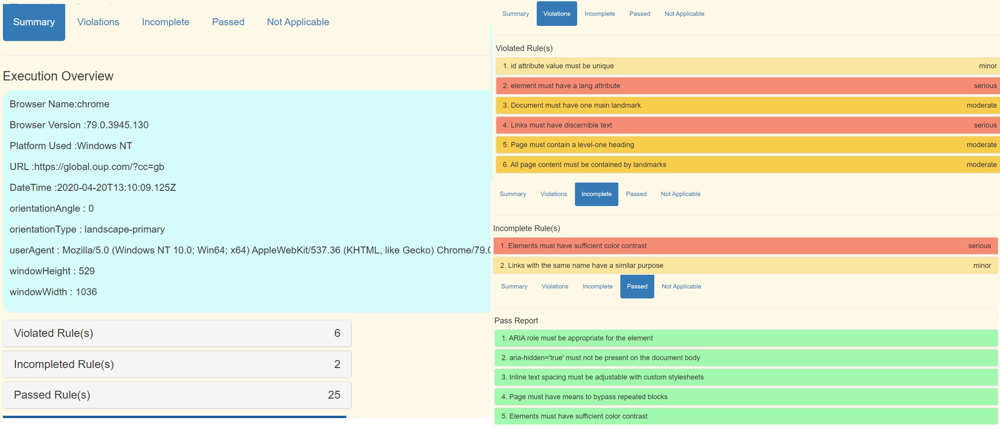

[](https://nodei.co/npm/klassi-js/)

# klassi-js [](https://app.shippable.com/projects/585832b28171491100bb123f) [](https://travis-ci.org/larryg01/klassi-js)


  A platform independent debuggable BDD Javascript testing framework. It's simple, easy to use . It's built on [nodeJs](https://nodejs.org/en/), [webdriver.io (the Selenium 2.0 
    bindings for NodeJS)](http://webdriver.io/) and [cucumber-js](https://github.com/cucumber/cucumber-js "view 
    cucumber js documentation") complete with integrated Visual and API Testing. 


## Installation

```bash
git-clone-ssh: git@github.com:larryg01/klassi-js.git
git-clone-https: https://github.com/larryg01/klassi-js.git
npm i klassi-js 


# To run your test locally, you'll need a local selenium server running, you can install and
# launch a selenium standalone server with chrome, firefox and phantomjs drivers via the 
# following commands in a separate terminal:

yarn global add selenium-standalone@latest
selenium-standalone install && selenium-standalone start
```

## Usage

```bash
# run 'yarn install' in a terminal window from within the project folder
node ../../index.js -ds ./step_definitions
or
node ../../index.js -dt @search // locally
or
yarn run bslocal chrome/@search // via browserstack
```

### Options

```bash
-h, --help                   output usage information
-v, --version                output the version number
-s, --steps <path>           path to step definitions. defaults to ./step-definitions
-p, --pageObjects <path>     path to page objects. defaults to ./page-objects
-o, --sharedObjects [paths]  path to shared objects - repeatable. defaults to ./shared-objects
-b, --browser <path>         name of browser to use. defaults to chrome
-r, --reports <path>         output path to save reports. defaults to ./reports
-d, --disableTestReport [optional]  disables the test report from opening after test completion
-t, --tag <tagName>          name of tag to run - Single TAG usage
--t, --tags <tagName>,<tagName>  name of tags to run - Multiple TAGS usage
-c, --context <path>        contextual root path for project-specific features, steps, objects etc
-f, --featuresPath <path>   path to feature definitions. defaults to ./features
-e, --email [optional]      sends email reports to stakeholders
-n, --environment [<path>]  name of environment to run the framework/test in. default to dev
-g, --reportName [optional] basename for report files e.g. use report for report.json
-x, --extraSettings [optional]  further piped configs split with pipes
-w, --remoteService [optional]  which remote driver service, if any, should be used e.g. browserstack
```

By default tests are run using Google Chrome, to run tests using another browser supply the name of that browser along with the `-b` switch. Available options are:

| Browser | Example |
| :--- | :--- |
| Chrome | `-b chrome` |
| Firefox | `-b firefox` |

The following variables are available within the ```Given()```, ```When()``` and ```Then()``` functions:

| Variable | Description |
| :--- | :---  |
| `browser`     | an instance of [web driver](https://webdriver.io/docs/setuptypes.html) (_the browser_) |
| `webdriverio`| the raw [webdriver](https://webdriver.io/docs/api.html) module, providing access to static properties/methods |
| `page`       | collection of **page** objects loaded from disk and keyed by filename |
| `shared`     | collection of **shared** objects loaded from disk and keyed by filename |
| `helpers`    | a collection of [helper methods](projects/example-test-suite/settings/helpers.js) _things webdriver.io does not provide but really should!_ |
| `expect`     | instance of [chai expect](https://www.chaijs.com/api/bdd/) to ```expect('something').to.equal('something')``` |
| `assert`     | instance of [chai assert](https://www.chaijs.com/api/assert/) to ```assert.isOk('everything', 'everything is ok')``` |
| `trace`      | handy trace method to log console output with increased visibility |
| `fs`         | exposes fs (file system) for use globally |
| `dir`        | exposes dir for getting an array of files, subdirectories or both |
| `got`    | exposes the GOT subroutine for API testing | ```use for making API calls``` |
| `date`       | exposes the date method for logs and reports  |
| `log`        | exposes the log method for output to files and emailing  |


### Visual Regression functionality with [Resemble JS](https://github.com/rsmbl/Resemble.js)

Visual regression testing, gives the ability to take and compare whole page screenshots or of specific parts of the application / page under test.
If there are Elements in the page that contain dynamic contents (like a clock or something like 'tip of the day'), you can hide this elements before 
taking the screenshot by passing the selector (or an array of selectors) to  the saveScreenshot function.
```js
// ./runtime/imageCompare.js

compareImage: async (fileName) => {
  const verify = require('./imageCompare');
  await verify.assertion(fileName);
  await verify.value();
  await verify.pass();
}

// usage within page-object file:
  await verify.saveScreenshot(fileName, elementsToHide);
  await helpers.compareImage(fileName);
```

### API Testing functionality with [got](https://github.com/sindresorhus/got#readme)
Getting data from a JSON REST API
```js
// ./runtime/helpers.js
 apiCall: function (url, method, body) {
    let endPoint = ('http://endpoint.com');
    
    let options = {
        url: endPoint,
        method: 'GET',
        json: true,
        simple: false,
        resolveWithFullResponse: true,
    };
    
    return gotApi(options)
    .then(async function (response, err) {
        if (err) {
           // API call failed
        }
        // response = API call is successful
    });
 },
```
## Accessibility Testing with [Axe](https://www.deque.com/axe/)
Automated accessibility testing feature has been introduced using the Axe-Core OpenSource library.

### Browser Support 
```
Microsoft Edge v40 and above
Google Chrome v42 and above
Mozilla Firefox v38 and above
Apple Safari v7 and above
Internet Explorer v9, 10, 11
```
### Sample code 
All the accessibility fuctions can be accessed through the global variable ``` accessibilityLib ```.
| function          | Description                                                     |
|----------------------------|-----------------------------------------------------------------|
| ``` accessibilityLib.getAccessibilityReport('PageName')```| generates the accessibility report with the given page name |
| ``` accessibilityLib.getAccessibilityError()``` | returns the total number of error count for a particular page. |
| ``` accessibilityLib.getAccessibilityTotalError() ``` | returns the total number of error count for all the pages in a particilar execution |

```js
When('I run the accesibility analysis for {string}', async function (PageName) {
  // After navigating to a particular page, just call the function to generate the accessibility report 
  await accessibilityLib.getAccessibilityReport(PageName);
});

Then('there should not be any violation in the accessibility report', function () {
// This will return the total accessibility error count for a particular page.
let violationcount=accessibilityLib.getAccessibilityError();
assert.equal(violationcount, 0);
});
```

### Test Execution Reports

HTML and JSON reports will be automatically generated and stored in the default `./reports` folder. This location can be
 changed by providing a new path using the `-r` command line switch:


### Accessibility Report

HTML and JSON reports will be automatically generated and stored in the default `./reports/accessibility`  folder.This location can be changed by providing a new path using the `-r` command line switch:



### Event handlers

You can register event handlers for the following events within the cucumber lifecycle.

const {After, Before, AfterAll, BeforeAll} = require('cucumber');

| Event          | Example                                                     |
|----------------|-------------------------------------------------------------|
| Before    | ```Before(function() { // This hook will be executed before all scenarios}) ```  |
| After     | ```After(function() {// This hook will be executed after all scenarios});```    |
| BeforeAll | ```BeforeAll(function() {// perform some shared setup});``` |
| AfterAll  | ```AfterAll(function() {// perform some shared teardown});```  |

## How to debug

Most webdriverio methods return a [JavaScript Promise](https://spring.io/understanding/javascript-promises "view JavaScript promise introduction") that is resolved when the method completes. The easiest way to step in with a debugger is to add a ```.then``` method to a selenium function and place a ```debugger``` statement within it, for example:

```js
  When(/^I search DuckDuckGo for "([^"]*)"$/, function (searchQuery, done) {
    driver.element('#search_form_input_homepage').then(function(input) {
      expect(input).to.exist;
      debugger; // <<- your IDE should step in at this point, with the browser open
      return input;
    })
    .then(function(input){
       input.setValue(selector, searchQuery);
       input.setValue(selector, 'Enter');

       done(); // <<- let cucumber know you're done
    });
  });
```

## Bugs

Please raise bugs via the [klassi-js issue tracker](https://github.com/larryg01/klassi-js/issues) and, if possible, please provide enough information to allow the bug to be 
reproduced.

## Contributing

Anyone can contribute to this project simply by [opening an issue here](https://github.com/larryg01/klassi-js/issues) or fork the project and issue a pull request with suggested improvements. In lieu of a formal styleguide, please take care to maintain the existing coding style.

## Credits

[John Doherty](https://www.linkedin.com/in/john-i-doherty)
 

## License

[Apache License](LICENSE) &copy; 2016 [Larry Goddard](https://uk.linkedin.com/in/larryg)
