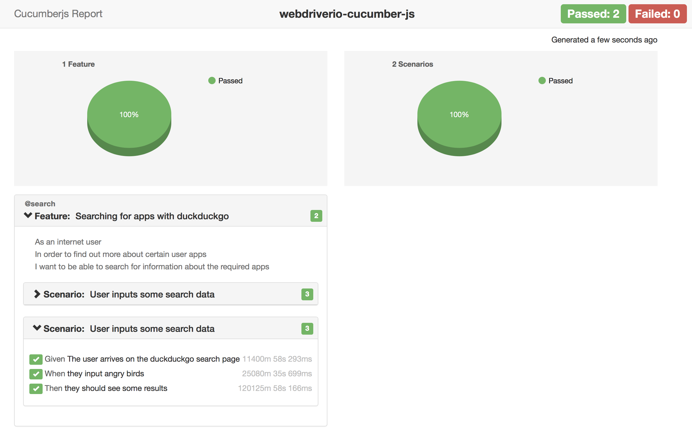
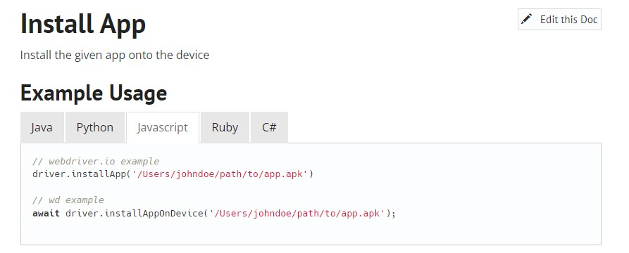

<p align="center">
    <h1 align="center" font-size: 2.5em > klassi-js <br>
    <a href="https://github.com/klassijs/klassi-js/">
        
    </a> </h1> </p>

<p align="center">
    <a href="https://github.com/klassijs/klassi-js/blob/master/LICENSE">
    
    </a> 
    <a href="https://gitter.im/klassijs/klassi-js">
    
    </a>
    <a href="https://webdriver.io/">
    
    </a>
    <a href="https://webdriver.io/docs/api.html">
    
    </a> <br>
  klassi-Js is a debuggable BDD Javascript test automation framework. Built on <a href="http://webdriver.io/"> webdriver.io <a/> (Next-gen browser and mobile automation test framework for Node.js)</a> and <a href="https://github.com/cucumber/cucumber-js"> cucumber-js </a> with integrated Visual, accessibility and API Testing, your test can run locally or in the cloud using Lambdatest, BrowserStack or Sauce Labs 
</p>
 

## Pre Installation

<a>Please check that you have these applications installed on your PC/Mac:
<li><a href="https://nodejs.org/">NodeJs</a></li>
<li><a href="http://java.sun.com/javase/downloads/index.jsp">Java JDK</a></li>
<li><a href="https://Atlassian.com/git/tutorials/install-git">Git</a> – You need to have an account on GitHub first</li> 
<li><a href="https://yarnpkg.com">Yarn</a></li></p>
If not, download and install them with just the default configuration, it is enough for framework usages.

## Installation

```bash
yarn add klassi-js
 
npm install klassi-js
```
## Upgrade to klassi-js v5
To upgrade existing projects for use with klassi-js v5, please follow these few steps [HERE](docs/upgradeDoc.md)

## Usage

```bash
node ./node_modules/klassi-js/index.js
```

## Options

```bash
--help                              output usage information
--version                           output the version number
--browser <name>                    name of browser to use (chrome, firefox). defaults to chrome
--tags <@tagName>                   name of cucumber tags to run - Multiple TAGS usage (@tag1,@tag2)
--exclude <@tagName>                name of cucumber tags to exclude - Multiple TAGS usage(@tag3,@tag5)
--steps <path>                      path to step definitions. defaults to ./step-definitions
--featureFiles <path>               path to feature definitions. defaults to ./features
--pageObjects <path>                path to page objects. defaults to ./page-objects
--sharedObjects <paths>             path to shared objects - repeatable. defaults to ./shared-objects
--reports <path>                    output path to save reports. defaults to ./reports
--disableReport                     disables the test report from opening after test completion
--email                             sends email reports to stakeholders
--env <path>                        name of environment to run the framework/test in. default to dev
--reportName <optional>             name of what the report would be called i.e. 'Automated Test'
--remoteService <optional>          which remote driver service, if any, should be used e.g. browserstack
--extraSettings <optional>          further piped configs split with pipes
--updateBaselineImages              automatically update the baseline image after a failed comparison or new images
--wdProtocol                        the switch to change the browser option from using devtools to webdriver
--browserOpen                       this leaves the browser open after the session completes, useful when debugging test. defaults to false', false
--dlink                             the switch for projects with their test suite, within a Test folder of the repo
--dryRun                            the effect is that Cucumber will still do all the aggregation work of looking at your feature files, loading your support code etc but without actually executing the tests
--utam                              this launches the compiler for salesforce scripts
--useProxy                          this is in-case you need to use the proxy server while testing'
--skipTag <@tagName>                provide a tag and all tests marked with it will be skipped automatically.
```
## Options Usage
```bash
  --tags @get,@put || will execute the scenarios tagged with the values provided. If multiple are necessary, separate them with a comma (no blank space in between).
  --featureFiles features/utam.feature,features/getMethod.feature || provide specific feature files containing the scenarios to be executed. If multiple are necessary, separate them with a comma (no blank space in between).
```

## Directory Structure
You can use the framework without any command line arguments if your application uses the following folder structure, to help with the built in functionality usage, we have added a .envConfigrc.js file at the base of the project which will contain all your env configs . You can check out the working [TEMPLATE HERE](https://github.com/klassijs/klassi-test-suite)

```bash
.
└── features
    └── search.feature
└── page-objects
    └── search.js
└── shared-objects
    └── searchData.js
└── step_definitions
    └── search-steps.js
└── reports  # folder and content gets created automatically on test run
    └── chrome
        ├── reportName-01-01-1900-235959.html
        └── reportName-01-01-1900-235959.json
.envConfigrc.js # this file will contain all your environment variables #environment configs
.dataConfigrc.js # this file will contain all your project variables #projectName, emailAddresses, lambdatest config
.env # this file contains all config username and passcode and should stay listed in the gitignore file
cucumber.js # the cucumber configuration file
```

## Step definitions
The following variables are available within the ```Given()```, ```When()``` and ```Then()``` functions:

| Variable | Description |
| :--- | :---  |
| `browser`     | an instance of [webdriverio](https://webdriver.io/docs/setuptypes.html) (_the browser_) |
| `wdio`| the raw [webdriverio](https://webdriver.io/docs/api.html) module, providing access to static properties/methods |
| `pageObjects`       | collection of **page** objects loaded from disk and keyed by filename |
| `sharedObjects`     | collection of **shared** objects loaded from disk and keyed by filename |
| `helpers`    | a collection of [helper methods](runtime/helpers.js) _things webdriver.io does not provide but really should!_ |
| `expect`     | instance of [chai expect](https://www.chaijs.com/api/bdd/) to ```expect('something').to.equal('something')``` |
| `assert`     | instance of [chai assert](https://www.chaijs.com/api/assert/) to ```assert.isOk('everything', 'everything is ok')``` |
| `trace`      | handy trace method to log console output with increased visibility |


## Helpers
Klassi-js contains a few helper methods to help along the way, these methods are:
```js
// Load a URL, returning only when the <body> tag is present
await helpers.loadPage('https://duckduckgo.com', 10);

// take image for comparisson
await helpers.takeImage('flower_1-0.png', 'div.badge-link--serp.ddg-extension-hide.js-badge-link');

// compare taken image with baseline image
await helpers.compareImage('flower_1-0.png');

// get the content of an endpoint
await helpers.apiCall('http://httpbin.org/get', 'get');

// writing content to a text file
await helpers.writeToTxtFile(filepath, output);

// reading content froma text file
await helpers.readFromFile(filepath);

// applying the current date to files
await helpers.currentDate();

// get current date and time (dd-mm-yyyy-00:00:00)
await helpers.getCurrentDateTime();

// clicks an element (or multiple if present) that is not visible, useful in situations where a menu needs a hover before a child link appears
await helpers.clickHiddenElement(selector, textToMatch);

// This method is useful for dropdown boxes as some of them have default 'Please select' option on index 0
await helpers.getRandomIntegerExcludeFirst(range);

// Get the href link from an element
await helpers.getLink(selector);

//wait until and element is visible and click it
await helpers.waitAndClick(selector);

// wait until element to be in focus and set the value
await helpers.waitAndSetValue(selector, value);

// function to get element from frame or frameset
await helpers.getElementFromFrame(frameName, selector);

// This will assert 'equal' text being returned
await helpers.assertText(selector, expected);

// This will assert text being returned includes
await helpers.expectToIncludeText(selector, expectedText);

// this asserts that the returned url is the correct one
await helpers.assertUrl(expected);

// this is the generating accessibility reports per page
await helpers.accessibilityReport: async (pageName, count = false || true);

//reading from a json file
await helpers.readFromJson();

//writing data to testData json file in shared objects folder
await helpers.write();

//writing data to a json file 
await helpers.writeToJson();

//writing json data from above to UrlData json file
await helpers.writeToUrlsData();

//merging json files
await helpers.mergeJson();

//hide elements
await helpers.hideElements();

//show elements
await helpers.showElements();

//reporting the current date and time
await helpers.reportDateTime();

//API call for GET, PUT, POST and DELETE functionality using PactumJS for API testing
await helpers.apiCall();

//function for recording Accessibility logs from the test run
await helpers.accessibilityReport();

//function for recording total errors from the Accessibility test run
await helpers.accessibilityError();

//Get the href link from an element
await helpers.getLink();

//function to get element from frame or frameset
await helpers.getElementFromFrame();

//Generate random integer from a given range
await helpers.generateRandomInteger();

//this generates the full execution time for a full scenario run
await helpers.executeTime();

//Generates a random 13 digit number
await helpers.randomNumberGenerator();

//Reformats date string into string
await helpers.reformatDateString();

//Sorts results by date
await helpers.sortByDate();

//this filters an item from a list of items
await helpers.filterItem();

//this filters an item from a list of items and clicks on it
await helpers.filterItemAndClick();

//this uploads a file from local system or project folder. Helpful to automate uploading a file when there are system dialogues exist.
await helpers.fileUpload();
```

## Browser usage
By default, the test run using Google Chrome/devtools protocol, to run tests using another browser locally you'll need a local selenium server running, supply the browser name along with the `--wdProtocol --browser` switch

| Browser | Example |
| :--- | :--- |
| Chrome | `--wdProtocol --browser chrome` |
| Firefox | `--wdProtocol --browser firefox` |

All other browser configurations are available via 3rd party services (i.e. browserstack | lambdatest | sauceLabs)

Selenium Standalone Server installation
```bash
npm install -g selenium-standalone@latest
selenium-standalone install
selenium-standalone start
```

## Visual Regression with [Resemble JS](https://github.com/rsmbl/Resemble.js)

Visual regression testing, the ability to compare a whole page screenshots or of specific parts of the application / page under test.
If there is dynamic content (i.e. a clock), hide this element by passing the selector (or an array of selectors) to the takeImage function.
```js
// usage within page-object file:
  await helpers.takeImage(fileName, [elementsToHide, elementsToHide]);
  await browser.pause(100);
  await helpers.compareImage(fileName);
```

## API Testing with [PactumJS](https://github.com/pactumjs/pactum#readme)
Getting data from a JSON REST API
```js
 apiCall: async (url, method, auth, body, status) => {
 let resp;
 const options = {
  url,
  method,
  headers: {
   Authorization: `Bearer ${auth}`,
   'content-Type': 'application/json',
  },
  body,
 };

 if (method === 'GET') {
  resp = await helpers.apiCall(url, 'GET', auth);
  return resp.statusCode;
 }
 if (method === 'POST') {
  resp = await helpers.apiCall(url, 'POST', auth, body, status);
  return resp;
 }
}
```
## Accessibility Testing with [Axe](https://www.deque.com/axe/)
Automated accessibility testing feature has been introduced using the Axe-Core OpenSource library.

### Sample code
All the accessibility fuctions can be accessed through the global variable ``` accessibilityLib ```.
| function          | Description                                                     |
|----------------------------|-----------------------------------------------------------------|
| ``` accessibilityLib.getAccessibilityReport('PageName')```| generates the accessibility report with the given page name |
| ``` accessibilityLib.getAccessibilityError()``` | returns the total number of error count for a particular page. |
| ``` accessibilityLib.getAccessibilityTotalError() ``` | returns the total number of error count for all the pages in a particilar execution |

```js
// usage within page-object file:
When('I run the accesibility analysis for {string}', async function (PageName) {
  // After navigating to a particular page, just call the function to generate the accessibility report and the total error count for the page
  await helpers.accessibilityReport: async (pageName, count = false || true)
});
```

## Test Execution Reports

HTML and JSON reports will be automatically generated and stored in the default `./reports` folder. This location can be
 changed by providing a new path using the `--reports` command line switch:



## Accessibility Report

HTML and JSON reports will be automatically generated and stored in the default `./reports/accessibility`  folder.This location can be changed by providing a new path using the `--reports` command line switch:


## Mobile App automation with [Appium](https://appium.io/docs/en/about-appium/getting-started/?lang=en)

Besides the ability to test web applications on mobile environments, the framework allows for the automation of native mobile applications running on Android or iOS in LambdaTest.

klassi-js contains sample tests that can be run by executing the following commands:
```
yarn run android
```

Or:

```
yarn run ios
```

### Environment configuration

The environment configuration needs to include the following information:

* **envName**: Android or iOS. The application will be installed before the test is run and uninstalled on cleanup.
* **appName**: the application package name. Used when handling and verifying app instalation, removal and can be used in selectors.
* **appPath**: remote path to the .APK file (Android) or ZIP file (iOS) containing the application. Because the files need to be accessible to the Appium instance running on LambdaTest, remote locations are preferred.

For instance:
```
{
  environment: {
      "android": {
          "envName": "android",
          "appName": "oxford.learners.bookshelf.canary",
          "appPath": "https://olb-android-release.s3-accelerate.amazonaws.com/test/olb-5.9.3-canary.apk"
      },
   }
}
```

### Mobile capabilities

As far as the mobile capabilities set on `./lambdatest/`, please use [LambdaTest's application](https://www.lambdatest.com/capabilities-generator/) to ensure that you select a correct combination of OS, Appium version and device name that will be accepted by LT.

As for properties that should be set to a specific option, please bear in mind the following considerations:

* **build**: should be set to *"klassi-js Mobile"* so test executions for native mobile apps can be filtered easily from web app tests.
* **browserName**: should be left empty so Lambdatest doesn't interpret that the intention is to test a web application.
* **networkThrottling**: should be kept as *"Regular 4G"*, during development it was detected that element selection is flaky if the emulators do not keep a steady connection, achieved through this throttling option.

For instance:

```
{
    "projectName": "klassi-js",
    "build": "klassi-js Mobile",
    "platformName" : "Android",
    "browserName": "",
    "deviceName" : "Galaxy Tab S7 Plus",
    "platformVersion" : "11",
    "appiumVersion" : "1.17.0",
    "deviceOrientation" : "LANDSCAPE",
    "networkThrottling": "Regular 4G",
    "console" : "true",
    "network" : true,
    "visual" : true
}
```

### Appium documentation

To learn about the APIs that can be used to interact with the mobile drivers, please refer to the [Appium documentation](https://appium.io/docs/en/about-appium/intro/). Find the specific functions by clicking on *Commands* and navigating to the specific section.

Please bear in mind that the page describing each function will contain information about how to invoke the function in different languages and compatibility with different drivers.

For instance, the page for the [App installation functions](https://appium.io/docs/en/commands/device/app/install-app/) describes that when used in JavaScript (specifically using WebdriverIO), `driver.installApp('/path/to/APK')` is the code to use (bear in mind when referencing the documentation that klassi-js uses WDIO asynchronously and that driver = browser, so we would use `await browser.installApp('/path/to/APK')`).



It also tells us that the function is compatible with XCUITest and UiAutomator2, so we can use it for our tests.


### Mobile selectors

As it is described in [WebDriverIO's website](https://webdriver.io/docs/selectors/#mobile-selectors), native app element selection can be achieved through different methods, though they are handled the same way at the framework level (i.e., `const elementName = await browser.$(selector);` or `const elementName = await browser.$$(selector);` for all elements that match the selectors).

**Pre-considerations for local environment**: the Appium server (included as a dependency of the project) should be running for the tests to be executed locally, which should should only be done for debugging or creating the tests, by running the `yarn run appium-start` command.

On Windows, both processes can be run concurrently using `start yarn appium-start & yarn android-local` or `start yarn appium-start & yarn ios-local`.

On iOS, the equivalent commands would be `yarn appium-start & yarn android-local` and `yarn appium-start & yarn ios-local`.

To verify that a local emulator or simulator is working correctly, use `adb devices` (Android) and `xcrun simctl list | grep Booted` (iOS).

**For Android testing,** it is recommended to use [UISelector class of the UI Automator API](https://developer.android.com/reference/android/support/test/uiautomator/UiSelector), passing the Java code to the selector method.

For instance:
```
const navbarBtn = await browser.$(android=new UiSelector().text("Toggle navigation").className("android.widget.Button"));
```

Please remember that this example should actually be implemented setting the selector in its own shared objects script (e.g., `browser.$(sharedObjects.android.elem.navbarBtn);`).

To retrieve the attributes that will be used in the selector, the [Appium Inspector desktop application](https://github.com/appium/appium-inspector) is recommended.

**For iOS testing,** it is recommended to use [Apple's UI Automation framework](https://developer.apple.com/library/prerelease/tvos/documentation/DeveloperTools/Conceptual/InstrumentsUserGuide/UIAutomation.html) to find elements and [Apple's API](https://developer.apple.com/library/ios/documentation/DeveloperTools/Reference/UIAutomationRef/index.html#//apple_ref/doc/uid/TP40009771).


## Event handlers

You can register event handlers for the following events within the cucumber lifecycle.

const {After, Before, AfterAll, BeforeAll, BeforeStep, AfterStep} = require('@cucumber/cucumber');

| Event          | Example                                                     |
|----------------|-------------------------------------------------------------|
| Before     | ```Before(function() { // This hook will be executed before all scenarios}) ```  |
| After      | ```After(function() {// This hook will be executed after all scenarios});```    |
| BeforeAll  | ```BeforeAll(function() {// perform some shared setup});``` |
| AfterAll   | ```AfterAll(function() {// perform some shared teardown});```  |
| BeforeStep | ```BeforeStep(function() {// This hook will be executed before all steps in a scenario with tagname;``` |
| AfterStep  | ```AfterStep(function() {// This hook will be executed after all steps, and take a screenshot on step failure;```  |

## How to debug

Most webdriverio methods return a [JavaScript Promise](https://spring.io/understanding/javascript-promises "view JavaScript promise introduction") that is resolved when the method completes. The easiest way to step in with a debugger is to add a ```.then``` method to the function and place a ```debugger``` statement within it, for example:

```js
  When(/^I search DuckDuckGo for "([^"]*)"$/, function (searchQuery, done) {
    elem = browser.$('#search_form_input_homepage').then(function(input) {
      expect(input).to.exist;
      debugger; // <<- your IDE should step in at this point, with the browser open
      return input;
    })
       done(); // <<- let cucumber know you're done
  });
```

## Commit conventions

To enforce best practices in using Git for version control, this project includes a **Husky** configuration. Note that breaking the given rules will block the commit of the code.

Bear in mind that the `/.circleci/config.yml` file **in each project using OAF as a dependency** needs to be modified to change from `yarn install` to `yarn install --network-concurrency 1`. This is to avoid race conditions in multiple calls to the registry during the installation process.

### Commits
After committing the staged code, the Husky scripts will enforce the implementation of the [**Conventional Commits specification**](https://www.conventionalcommits.org/en/v1.0.0/#summary).

To summarize them, all commits should follow the following schema:

```
git commit -m "<type>: <subject>"
```

Where **type** is one of the following:

- **fix**: a commit of the type fix patches a bug in your codebase (this correlates with PATCH in Semantic Versioning).
- **feat**: a commit of the type feat introduces a new feature to the codebase (this correlates with MINOR in Semantic Versioning).
- **BREAKING CHANGE**: a commit that has a footer BREAKING CHANGE:, or appends a ! after the type/scope, introduces a breaking API change (correlating with MAJOR in Semantic Versioning). A BREAKING CHANGE can be part of commits of any type.
- Types other than **fix:** and **feat:** are allowed, for example @commitlint/Tconfig-conventional (based on the Angular convention) recommends **build:, chore:, ci:, docs:, style:, refactor:, perf:, test:**, and others.
  footers other than **BREAKING CHANGE:** may be provided and follow a convention similar to git trailer format.

Please keep in mind that the **subject** must be written in lowercase.

### Branch naming

The same script will also verify the naming convention. Please remember that we only allow for two possible branch prefixes:

- **testfix/**
- **automation/**

## Demo
To demo the framework without installing it into your project use the following commands:
```js
 # download this example code
  git clone https://github.com/klassijs/klassi-js.git

 # browser to the new directory
  cd klassi-js

 # run the search feature
  yarn install
  node index.js --tags @search
```

## Bugs

Please raise bugs via the [klassi-js issue tracker](https://github.com/klassijs/klassi-js/issues), please provide enough information for bug reproduction.

## Contributing

Anyone can contribute to this project, PRs are welcome. In lieu of a formal styleguide, please take care to maintain the existing coding style.

## Credits

[John Doherty](https://www.linkedin.com/in/john-i-doherty)


## License

Licenced under [MIT License](LICENSE) &copy; 2016 [Larry Goddard](https://www.linkedin.com/in/larryg)
