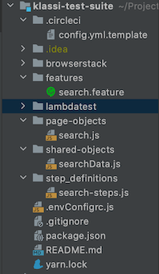
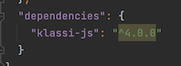
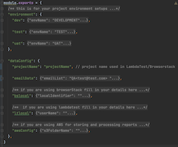

How to use klassi-Js

klassi-js is a debuggable BDD JavaScript testing framework built on NodeJS, webdriverIO (in standalone mode) and cucumber. It&#39;s simple and easy to setup and have a few integrated features like Visual, Accessibility and API testing.

We have also configured it to work with Lambdatest and Browserstack for cross browser testing and AWS s3 for test report storage and retrieval via email and CircleCi for continuous integration out of the box.

folder structure format

framework usage in package.json

The content of the &#39;.envConfigrc.js&#39; and &#39;config.yml&#39; files and the &#39;lambdatest / browserstack&#39; folder can be found in the template.

format of content in &#39;.envConfigrc.js&#39; file

Other folders used by the framework are the reports, artifacts, logs and visual-regression folders which are all auto-created at runtime.

We are using webdriverio in Standalone Mode so we have created an &#39;index.js&#39; file where all the necessary configuration is done and a &#39;runtime&#39; folder where all the required and necessary files for keeping the wheels of the framework turning.

We have also created a [TEMPLATE](https://github.com/larryg01/klassi-test-suite) to get you started, just clone the template and run &#39;yarn install&#39; and &#39;yarn run start&#39; to run the example test and confirm setup.